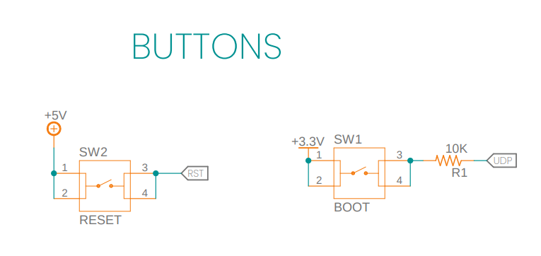

# CH552: "Conexión a Neopixel WS2812"

El chip CH552 es un microcontrolador USB con capacidades de E/S versátiles en esta ocasión control de  tiras de LED RGB programables individualmente conocidas como Neopixels. Para conectar el chip CH552 a Neopixels, necesitarás entender los conceptos básicos de comunicación y control de Neopixels a través de protocolos como WS2812.

Los Neopixels utilizan el protocolo WS2812, que implica enviar una serie de bits que representan los valores de color para cada LED en la cadena. Se debe generar la secuencia de bits de acuerdo con las especificaciones del protocolo.
## Configuración Básica

Aquí hay una guía general sobre cómo podrías conectar el chip CH552 a Neopixels:
```
// -------                                 CH552
//                                       +--\/--+
//           DIN  ---------------- P32  1|°     |16  V33 -------------
//                ---------------- P14  2|      |15  Vcc -------------
//                ---------------- P15  3|      |14  GND -------------
//                ---------------- P16  4|      |13  P37 UDM --- USB D-
//                ---------------- P17  5|      |12  P36 UDP --- USB D+
//                ---------------- RST  6|      |11  P34 -------------
//                ---------------- P31  7|      |10  P33 -------------
//                ---------------- P30  8|      |9   P11 -------------
//                                       +------+

```
* **Conexiones físicas:** Conecta la salida de datos del Neopixel (generalmente marcada como "DIN" o "Data Input") a un pin de salida del chip CH552 para este ejemplo usaremos el PIN  P32. Asegúrate de que los niveles de voltaje sean compatibles (generalmente 5V).

* **Fuente de Alimentación:** Asegúrate de tener una fuente de alimentación adecuada para los Neopixels. Pueden requerir más corriente de la que el chip CH552 puede proporcionar directamente, regularmente un led WS2812 a su máximo brillo puede llegar a consumir hasta 60 mA.

# Configurando el entorno! 👋

Utiliza el software de programación compatible con el chip CH552 para enviar los comandos adecuados a los Neopixels. 

Código Ejemplo: [Neopixel_lite](https://github.com/UNIT-Electronics/ch552_neopixel/tree/main/software/neopixel_lite)

Para comprobar el funcionamiento de nuestro ejemplo, recomendamos uso del Arduino IDE para cargar los archivos ([Guia_config_ch552](https://github.com/UNIT-Electronics/CH552-en-Arduino/)).

Por lo que para poder iniciar con nuestro despliesgue se necesita:


1. Descargar el archivo Neopixel_lite.
1. Dentro de la carpeta encontrarás un archivo que lleva por nombre "neopixel_lite.ino" abre el archivo con Arduino IDE.
1. Para poder cargar el archivo, configura el entorno con las siguientes especificaciones:

    * `Reloj`: *16 Mhz.*
    * `Método de carga`: *USB.*
    * `Ajuste de carga a: ` *"USER CODE /w 2866 USB RAM"*.    

1. Para completar la carga del código, presiona el botón de boot mientras se conecta vía USB. 


>


## 🛠️ Abre y ejecuta el proyecto

La configuración de la conexión, se encuentra asignada en el archivo de la ruta `scr/config.h`
```
// Pin definitions
#define PIN_NEO             P32          // GPIO Utilizado para este ejemplo

```
Prueba de funcionamiento


Puedes cambiar la configuración de velocidad y número Neopixels, así como nivel de iluminación.

```

#define delay 100
#define NeoPixel 16 // Number Neopixel conect
#define level 64 // Ilumination level 0 to 255

```
## Referencias

Para mayor información, estos son algunos proyectos que usan la configuración del ch55x.

* [CH55xduino](https://github.com/DeqingSun/ch55xduino)

* [CH552-USB-OLED](https://github.com/wagiminator/CH552-USB-OLED)

* [CH552E MacroPad mini](https://github.com/wagiminator/CH552-Macropad-mini)

 **Información Previa**

 * [Configurando_tu_entorno](https://github.com/UNIT-Electronics/CH552-en-Arduino/)

 **Proyecto que te puede interesar**

 * [Oled_CH552](https://github.com/UNIT-Electronics/OLED_ch552)